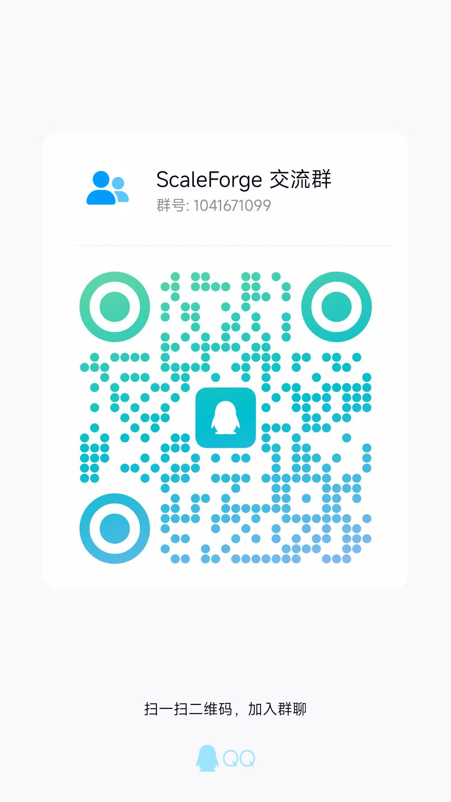

# Headscale-Admin-AE

[](https://go.dev/)
[](https://github.com/juanfont/headscale/releases/tag/v0.28.0)
[](https://github.com/juanfont/headscale/releases/tag/v0.29.2)
[](#数据库与迁移)

Headscale-Admin-AE 是服务于 ScaleTail 和 ScaleForge 的自托管控制面。项目基于
`juanfont/headscale v0.28.0` 裂变维护，并按审计结果定向回补后续版本的稳定性修复；
它不是官方 headscale 的直接替代包，也不继续兼容官方的多套登录入口。

仓库地址：[chen1749144759/Headscale-Admin-AE](https://github.com/chen1749144759/Headscale-Admin-AE)

## 当前认证模型

本分支只支持一套面向用户的身份体系：**ScaleForge 账户名和密码**。

- ScaleForge 管理后台和 ScaleTail 节点使用同一账户身份。
- 密码使用 bcrypt 保存，长度必须为 12 至 72 字节。
- 密码最长有效期固定为 90 天；管理员发放的一次性初始密码和到期密码可由新版 ScaleTail Windows 客户端在 Noise 加密通道内直接更新，无需普通用户访问 ScaleForge。
- 新密码不能复用当前密码和最近四个历史密码；管理员重置会要求账户下次登录立即修改临时密码。
- 修改或重置密码会提升密码版本、撤销旧管理会话，并使节点重新完成账户证明。
- 新的 ScaleTail 控制会话必须在加密的 Noise 会话内提交账户证明，密码不会作为节点长期密钥保存到服务端。外层控制地址可以使用 HTTP 或 HTTPS；HTTP 部署要求客户端通过 TOFU 记录或显式 pin Noise 服务端公钥，并在公钥异常变化时拒绝发送凭据。
- 账户可单独禁用、设置账户到期时间、绑定网络并限制可注册节点数量。
- 账户认证节点的有效期不会超过“密码修改时间 + 90 天”或账户到期时间中的较早值。

```text
ScaleTail
  | HTTP(S) + TS2021 Noise + account proof
  v
Headscale-Admin-AE
  | private Unix socket
  v
ScaleForge
```

### 已禁用的旧入口

以下方式不属于当前产品协议，不能用于新节点接入或远程管理：

- 预认证 Key（pre-auth key / auth key）。
- Headscale API Key。
- OIDC 登录和浏览器授权页面。
- `headscale auth register` / `headscale nodes register` 手工批准流程。
- 暴露到公网的 REST 管理 API 或远程 gRPC 管理端口。

`headscale preauthkeys` 与 `headscale apikeys` CLI 入口已经移除；对应 gRPC CRUD
返回 `FailedPrecondition`。仓库仍保留部分旧数据库表、模型和 protobuf 定义，仅用于
读取旧数据库、保持迁移顺序和协议结构稳定，**不表示这些功能仍可使用**。

## 管理边界

公网监听地址只提供 ScaleTail 控制协议、健康检查、版本、更新检查和启用后的内置
DERP，不挂载 `/api/v1`、Swagger 或远程 gRPC 管理接口。

管理通道分为三个 Unix Domain Socket：

| Socket | 用途 | 建议权限 |
|---|---|---:|
| `unix_socket` | Headscale 本机管理 gRPC，仅供同主机受信任管理员使用 | `0770` |
| `scaleforge.socket` | Headscale 向 ScaleForge 提供的私有管理 HTTP 网关 | `0660` |
| `scaleforge.backend_socket` | Headscale 转发已认证节点的上报、策略和更新请求 | 由 ScaleForge 管理 |

部署时只把 `scaleforge.socket` 挂载到 ScaleForge 后端容器，不能映射为 TCP 端口，
也不能交给反向代理公开。Socket 所在目录和容器用户组是管理边界的一部分。

两个 ScaleForge 私有方向都必须配置同一个 `scaleforge.internal_auth_key_file`。密钥至少
32 字节，只从 Docker/Kubernetes secret 读取。每个请求使用 HMAC-SHA256 绑定方法、路径、
查询、正文、时间戳、nonce、授权头及节点/用户上下文；超过 60 秒或重复 nonce 的请求会被拒绝。

启用 `scaleforge.trust_proxy` 时还必须设置最小范围的
`scaleforge.trusted_proxy_cidrs`。只有来自这些 CIDR 的反向代理才允许提供客户端 IP 头，
不要在生产环境填写 `0.0.0.0/0` 或 `::/0`。

首个管理账户仅在账户表为空时创建。初始密码必须通过 Docker/Kubernetes secret
文件传入 `scaleforge.bootstrap_password_file`，不要写进 YAML、Compose、镜像、日志
或 Git 仓库。

## 旧版本迁移

升级前必须备份数据库、配置、Noise 私钥和 DERP 私钥。

1. 启动迁移会把旧 `users` 扩展字段转换为独立的 `accounts` 与
   `account_sessions` 表。
2. 迁移账户会被标记为必须修改密码；旧节点只要不是 `password` 注册方式就会到期。
3. 旧版不受支持的密码哈希不会被误当成明文，迁移会失败并要求管理员先重置密码。
4. 升级后使用新版 ScaleTail Windows 客户端登录；若账户要求强制改密，客户端会要求设置新密码并自动继续连接。管理账户也可以在 ScaleForge 中修改密码。
5. 不要尝试用旧预认证 Key、API Key、OIDC 或手工注册恢复节点。
6. 0.0.8 以前的 ScaleTail 无法验证新的账户协议和 OTA v3；需先手工覆盖安装一次 0.0.8。

保留 PostgreSQL/SQLite 数据卷进行增量迁移，不要执行会删除数据卷的
`docker compose down -v`。

## 内置 DERP

推荐使用随控制面部署的内置 DERP，默认生产组合为：

```yaml
derp:
  server:
    enabled: true
    verify_clients: true
    stun_listen_addr: 0.0.0.0:3478
    private_key_path: /var/lib/headscale/derp.key
  urls: []
  auto_update_enabled: false
```

- 控制面的 `server_url` 可以使用 HTTP 或 HTTPS；内置 DERP 仍需提供 TLS，且 DERP 域名和端口必须可从公网访问。
- `verify_clients: true` 只允许本控制面的有效节点使用中继。
- `urls: []` 和 `auto_update_enabled: false` 表示不混入公共 DERP map。
- DERP 私钥必须持久化，并且不能与 Noise 私钥共用。
- 至少开放 DERP HTTPS 端口和 STUN `UDP/3478`。
- 单内置 DERP 是单点故障；需要高可用时应另行规划多个受控 DERP region。

详细规则见 [DERP 文档](docs/ref/derp.md)。

## 数据库与迁移

支持 SQLite 和 PostgreSQL。ScaleForge 组合部署使用 PostgreSQL，并共享同一套业务
数据；控制面启动时会增量补齐账户、会话及 ScaleForge 配套表结构。

独立部署时，Headscale 数据库角色需要拥有其控制面 schema，才能执行 GORM 增量迁移。
ScaleForge 组合部署会由 `db-bootstrap` 建立 Headscale schema owner、ScaleForge NOLOGIN
owner 和两个相互独立的运行角色；平台迁移使用管理员角色，ScaleForge 运行角色不具有
DDL 权限，也不能读取密码哈希。迁移失败时服务应停止，不要绕过错误继续提供部分可用的控制面。

## 构建与验证

```bash
go test ./...
go build -trimpath -o headscale ./cmd/headscale
```

启动前至少确认：

- `server_url` 与 ScaleTail 填写的 HTTP 或 HTTPS 控制地址一致；使用 HTTP 时必须启用客户端 Noise 公钥 TOFU/pin 校验。
- 三个 Unix socket 路径不同，且只挂载给对应容器。
- Bootstrap 密码与内部 HMAC 密钥来自不同的 secret 文件，且均未写入配置或镜像。
- 可信代理 CIDR 只包含实际反向代理网络。
- 数据库迁移日志无错误。
- 内置 DERP 的域名、证书、TCP 端口和 `UDP/3478` 可达。
- 旧节点已使用新版 ScaleTail 完成账户重新登录。

## 版本定位

| 项目 | 当前说明 |
|---|---|
| 裂变来源 | `juanfont/headscale v0.28.0` |
| 对标版本 | 定向回补 headscale `v0.29.2` 的注册、NodeStore、策略并发和稳定性修复 |
| Go | `go.mod` 指定的 Go 工具链 |
| 管理平台 | ScaleForge |
| 客户端 | ScaleTail |

继续同步上游时必须逐项审计控制协议、数据库迁移、NodeStore、ACL、DERP 和
ScaleForge 私有接口，不能直接整仓覆盖。

## 交流学习

欢迎加入 ScaleForge 交流群，一起交流自建 Headscale、ScaleTail、ScaleForge 的
部署、使用和二次开发经验。

群号：`1041671099`



## 打赏


## 致谢

- [juanfont/headscale](https://github.com/juanfont/headscale)
- [tailscale/tailscale](https://github.com/tailscale/tailscale)
- [ScaleForge](https://github.com/chen1749144759/ScaleForge)
- [ScaleTail](https://github.com/chen1749144759/ScaleTail)
